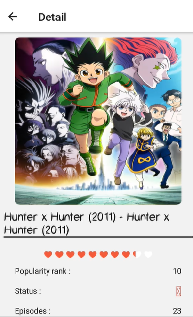
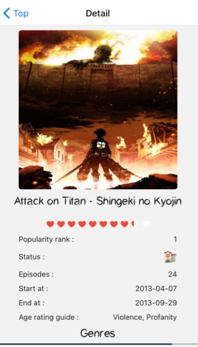

# Application sous React Native

## Principe

L'application te montre tous les mangas et animes disponibles. Elle fait pour les amateurs ou passionnés d'animations japonaises qui souhaitent lire/regarder des mangas/animés qui n'ont pas vus/lus. Elle est aussi pour les gens qui sont curieux et qui souhaitent découvrir cette univers.

La mascotte de notre application est :

## Les différentes pages

- Accueil (Home)
- Profile (Profil)
- Nouveauté/ À venir (Upcomming)
- Top (Top)
- Recherche (Reseach)
- Genre (Genre)
- Contact (Contact)
- :construction:

## Fonctionnalité

- Accueil :white_check_mark:
- Profil :construction:
- Upcomming :white_check_mark:
- Top :white_check_mark:
- Recherche :white_check_mark:
- Genre :white_check_mark:
- Contact :white_check_mark:
- :construction:

## Installation

### Importer le projet

Cloner le projet ou télécharger le projet dans un répertoire

Dans votre environnement de travail
`expo install -g expo-cli`

Dans le projet
`npm install`

`expo start ou expo start:web`
Aller sur le lien [http://localhost:19002](http://localhost:19002) ou [http://localhost:19006](http://localhost:19006)

### Compte test

**Identifiant** : test  
**Mot de passe** : password

> La créaction de compte n'est pas encore disponible :construction:

### Simuler sous Android ou iOS

- [Celui ci est le fichier pour simuler sur Android](https://gitlab.com/ChrisChrisW/reactjs_lp/-/blob/master/render/simulator/manga-encyclopedia.aab)
- [Celui là est le fichier pour simuler sur iOS](https://gitlab.com/ChrisChrisW/reactjs_lp/-/blob/master/render/simulator/manga-encyclopedia.tar.gz)

### Télécharger l'application

- [L'application sous Android](https://gitlab.com/ChrisChrisW/reactjs_lp/-/blob/master/render/manga-encyclopedia.apk)
  > Renommer le fichier en enlevant l'extension zip
- L'application sous iOs n'est pas encore disponible :construction:

## Lien vers le projet

Vous pouvez retrouver le projet sur :

- [Lien projet expo](https://expo.io/@chugow/projects/manga-encyclopedia)
- [Lien snack expo](https://snack.expo.io/@chugow/react-native-lp-manga-encyclopedia)

> Par Christophe WANG  
> Etudiant en LP MDN 2020-2021  
> Dernière mise à jour : 06/02/2021

---

- Peut être ajouter un API pour ajouter les recherches sur les jeux vidéos de toutes les platformes
